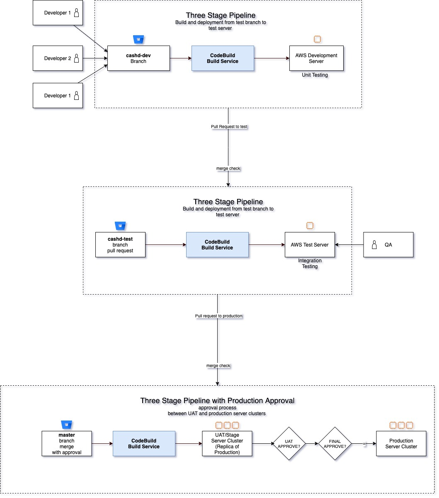

## Objective
Create CICD pipelines with three stages for multiple environments as per diagram below:  



## Prerequisites
| Requirement | Description |
| ----------- | ----------- |
| Terraform | [Installation Instructions](https://learn.hashicorp.com/tutorials/terraform/install-cli) |
| AWS Account and CLI Credentials | [Create Account](https://console.aws.amazon.com/console/home) |
| Terraform Backend | [Setting up backend](https://www.terraform.io/language/settings/backends/s3)
| S3 Bucket |   [Create S3 bucket for storing code-pipeline artifacts](https://docs.aws.amazon.com/AmazonS3/latest/userguide/create-bucket-overview.html)|

## Installation

1. Update `setup/state.tf` file with an AWS cli profile with admin access, Terraform backend state and lock file using pre-configured S3 bucket and DynamoDB table.
2. Deploy using Terraform and AWS provider
```
cd setup
terraform plan -out infra-plan.json
terraform apply 
```
